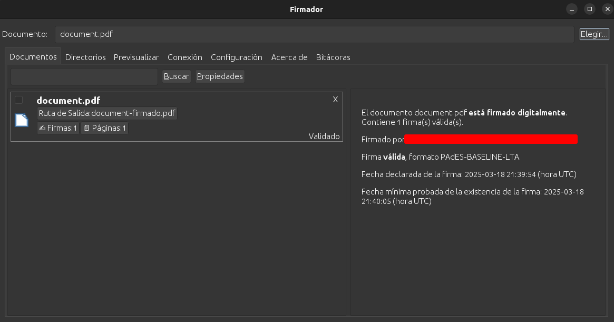
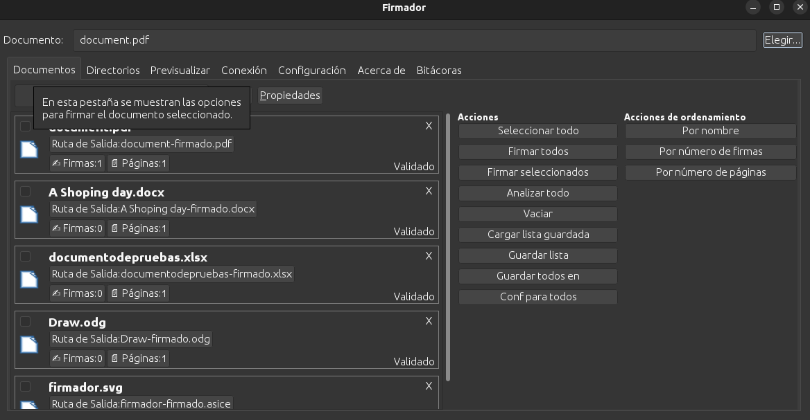
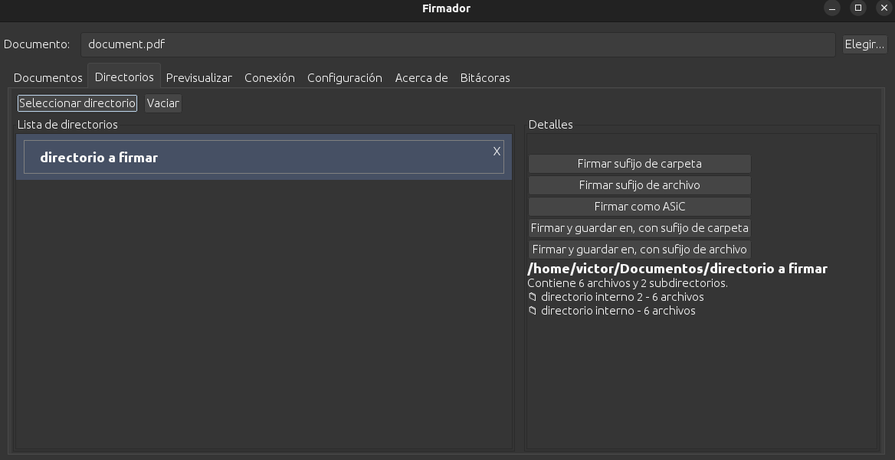

Firmador 2.0.0
==================

Notas de la versión
-------------------

Firmador Libre 2.0.0 representa una actualización mayor respecto a la versión 1.9.8, incorporando nuevas características y mejoras significativas en la experiencia de usuario, así como una interfaz renovada y ampliación de funcionalidades.

Detalles de la actualización
----------------------------

Nuevos firmadores
-----------------

Esta versión introduce soporte para los siguientes motores de firma digital:

- Firmador OpenXmlFormat
- Firmador JAdES
- Firmador ASiC
- Firmador Virtual

Gracias a estas incorporaciones, Firmador Libre ahora permite la firma de una gama mucho más amplia de documentos, incluyendo toda la familia de formatos de Microsoft Office, archivos JSON, y prácticamente cualquier tipo de archivo mediante el estándar ASiC-E.

El **Firmador Virtual** representa una nueva capacidad que permite la firma de documentos alojados en servicios remotos, sin necesidad de descargarlos localmente. Este firmador coordina el proceso de firma entre la aplicación local y los servicios externos, manteniendo la seguridad al realizar la firma criptográfica en la máquina del usuario.

**Nota:** El firmador ASiC se ofrece como funcionalidad adicional, pero actualmente no está contemplado entre los formatos oficiales reconocidos en Costa Rica.

Panel de documentos
-------------------

La aplicación presenta una interfaz gráfica completamente renovada para la gestión eficiente de documentos. Esta mejora facilita la adición, eliminación y organización de los archivos a firmar, optimizando el flujo de trabajo.

La antigua pestaña de validación ha sido eliminada; ahora, la validación de firmas se visualiza directamente en la pestaña de documentos, junto al documento seleccionado, lo que permite un acceso más ágil y centralizado a esta información.

Además, se ha añadido una opción de “Propiedades” en la misma pestaña, la cual despliega un panel con funciones adicionales para la gestión documental, como el firmado masivo y el acceso a metadatos del archivo.

Ahora, es posible arrastrar archivos y carpetas directamente a la pestaña de documentos, facilitando la carga rápida y eficiente de documentos.

Panel de directorios
--------------------

Se incorpora un nuevo panel de directorios, el cual permite gestionar carpetas y directorios completos. Desde este panel, los usuarios pueden firmar en cadena todos los documentos y subdirectorios contenidos en la carpeta seleccionada.

Panel de previsualización
-------------------------

El antiguo panel de firma ha sido transformado en un panel de previsualización, permitiendo a los usuarios visualizar el documento antes de proceder con la firma. Su funcionamiento y experiencia de uso se mantienen consistentes con versiones anteriores.

Panel de conexiones
-------------------

Se ha añadido un panel de conexiones que permite gestionar y configurar diferentes servicios de firma digital. Este panel representa una funcionalidad completamente nueva que habilita la integración de Firmador Libre con sistemas externos.

Servicios soportados
~~~~~~~~~~~~~~~~~~~~

El panel de conexiones actualmente soporta:

- **Firmador Remoto**: Servicio de firma remota desarrollado por el equipo de Firmador Libre
- **GAUDI**: Sistema de gestión documental

Sistema de documentos virtuales
~~~~~~~~~~~~~~~~~~~~~~~~~~~~~~~~

Una de las características más importantes de este panel es la capacidad de recibir y procesar **documentos virtuales** desde servicios remotos. Los documentos virtuales son aquellos que:

- Residen en servidores externos y no necesitan descargarse completamente
- Se visualizan mediante metadatos y previsualizaciones proporcionadas por el servicio
- Se firman usando el Firmador Virtual, que coordina el proceso entre la aplicación local y el servicio remoto
- Mantienen la seguridad al realizar la firma criptográfica localmente con la tarjeta del usuario

Flujo de trabajo con documentos virtuales
~~~~~~~~~~~~~~~~~~~~~~~~~~~~~~~~~~~~~~~~~~

1. El usuario se conecta a un servicio mediante el panel de conexiones
2. El servicio remoto envía documentos pendientes de firma (solo metadatos y vista previa)
3. El usuario visualiza los documentos en la pestaña correspondiente
4. Al firmar, el Firmador Virtual:

   - Obtiene los hash de los documentos desde el servicio remoto
   - Firma los hash localmente usando la tarjeta del usuario
   - Envía las firmas de vuelta al servicio remoto
   - El servicio completa el proceso de firma en sus documentos originales

5. Los documentos firmados permanecen en el servicio remoto

Configuración de conexiones
~~~~~~~~~~~~~~~~~~~~~~~~~~~~

El panel permite:

- Añadir nuevas conexiones especificando URL y credenciales
- Gestionar múltiples servicios simultáneamente
- Ver el estado de cada conexión (conectado/desconectado)
- Desconectar servicios cuando ya no se necesiten
